# ArteryNetworkPaperFigures

This repository contains the appendix figures for our [paper](link):

> Paper info

If you find the code useful for your research, please cite our paper:

> Paper reference

# Appendix Figures

<!--- 
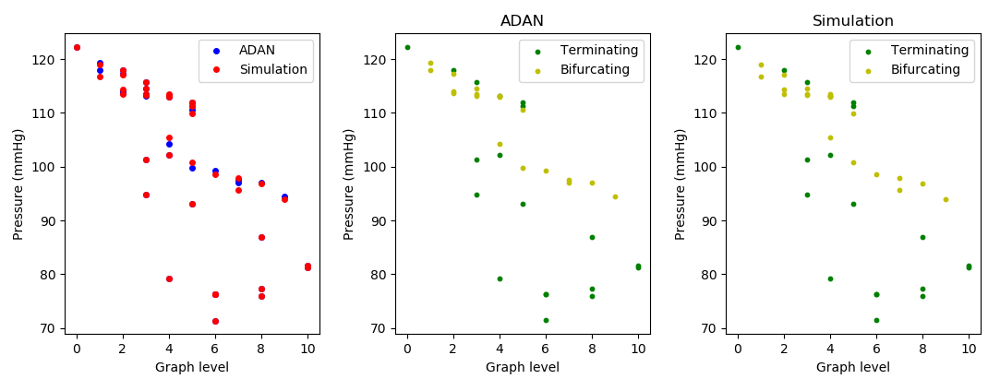

--->

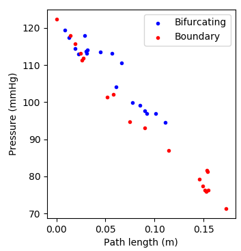
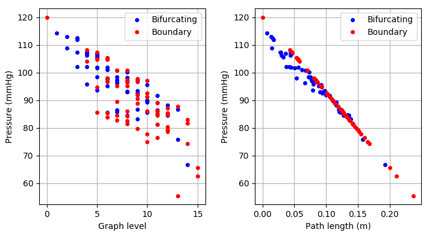

(a) Comparison between simulated pressure and pressure from ADAN on a node-by-node basis with respect to the graph level. Terminating pressures in the simulation are set to be the same as those in the ADAN result. (b) The relationship between pressure from the ADAN result at each node with respect to its path length. It remains an open question as of why there is such a strong relationship between them. (c) Simulated pressure for compartment LMCA for each node with respect to graph level and path length.

---
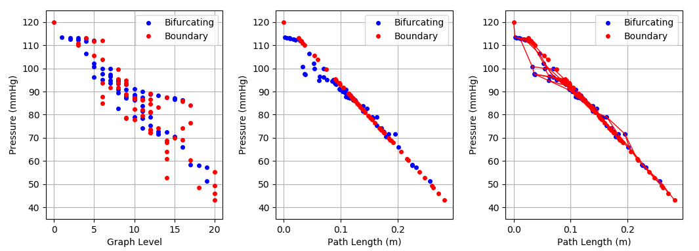

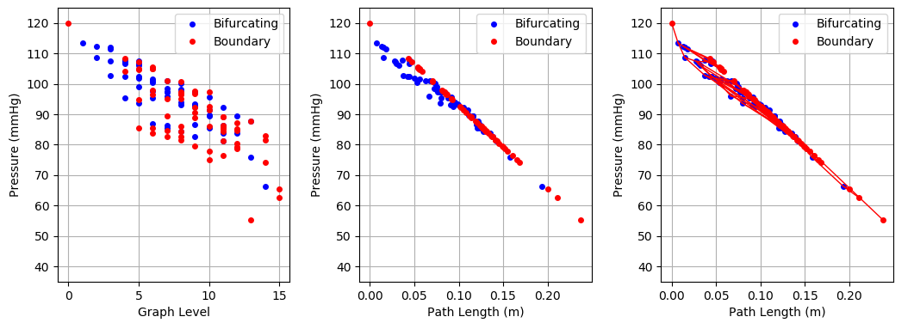

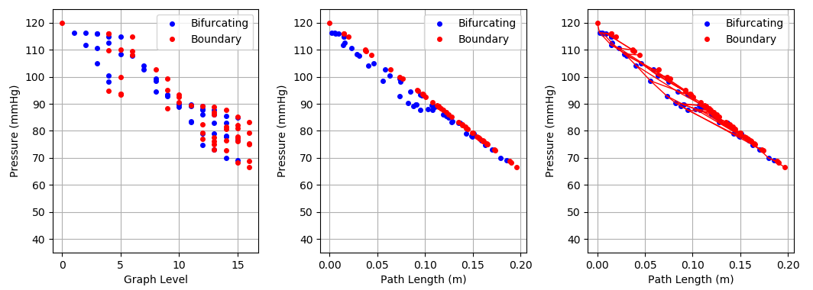

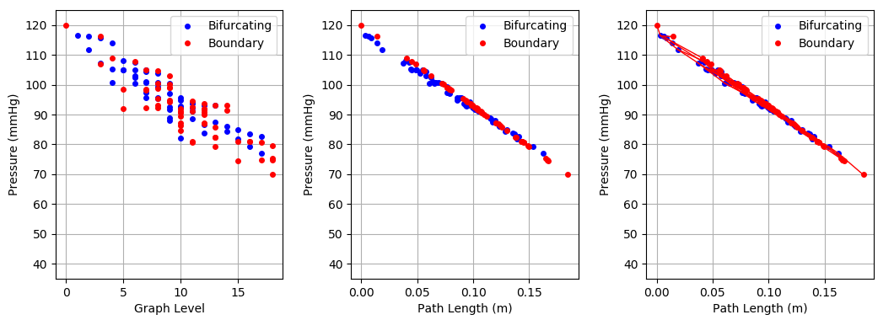

Fluid flow simulation results of the four compartments (from top to bottom: LMCA/RMCA/LPCA/RPCA) of the Speck arterial network with 150/250 um resolution.

---
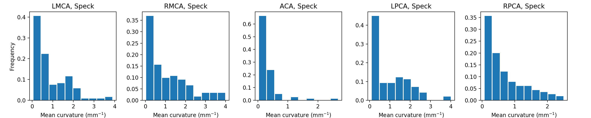

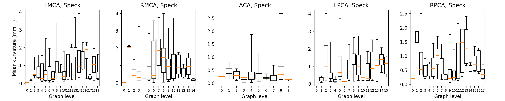

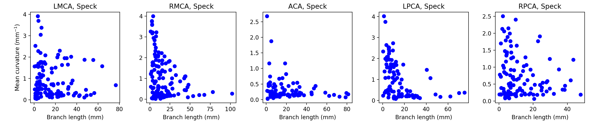

Distribution of the mean curvature of each branch, and relationship between curvature and graph level or branch length for each of the five compartments at Speck dataset. We studied the graph's shape in bifurcating nodes by calculating the local and remote amplitude angles, and found a high mean and a wide range of angles between two branches in each bifurcating node (e.g., mean$\pm$std of local amplitude is (104.19+-32.23), with min-max range of 12.63-174.10). We further studied how branches curve by calculating their mean curvature, and found that there is a trend towards increasing curvature as graph levels increase, and as branch lengths decrease. 

---
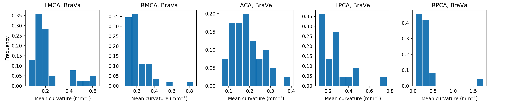

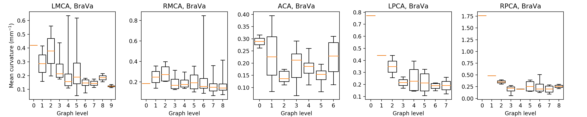

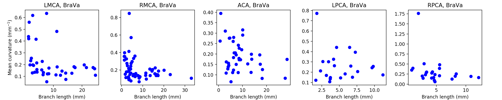

Distribution of the mean curvature of each branch and relationship between curvature and graph level or branch length for each of the five compartments of the single subject from BraVa dataset.

---

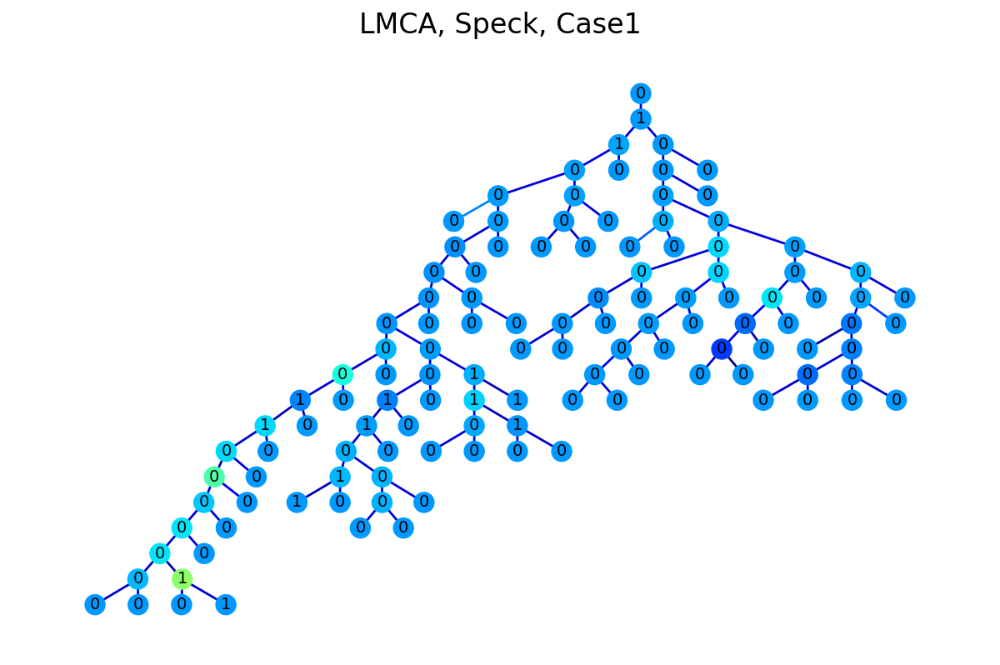
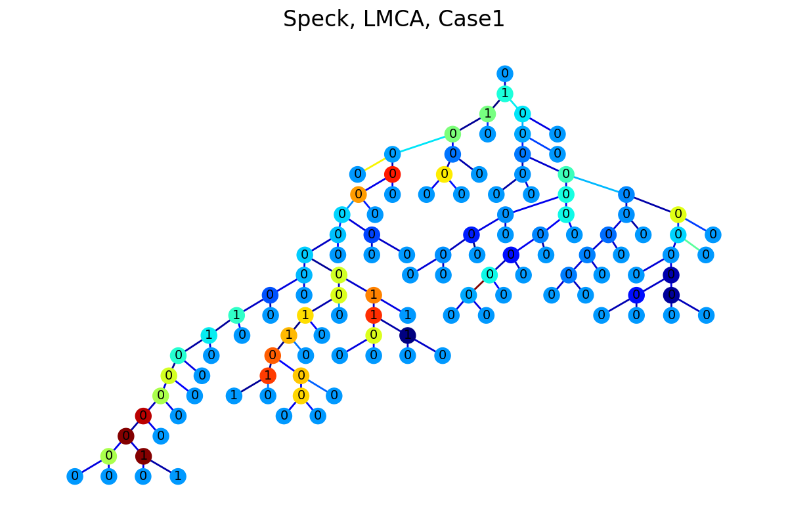
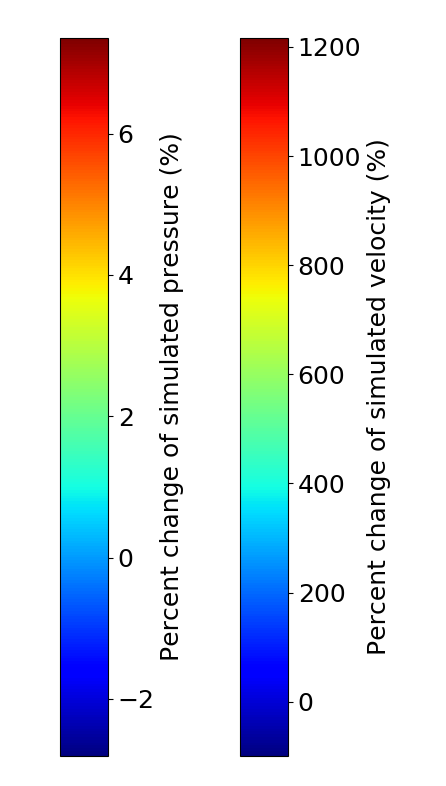

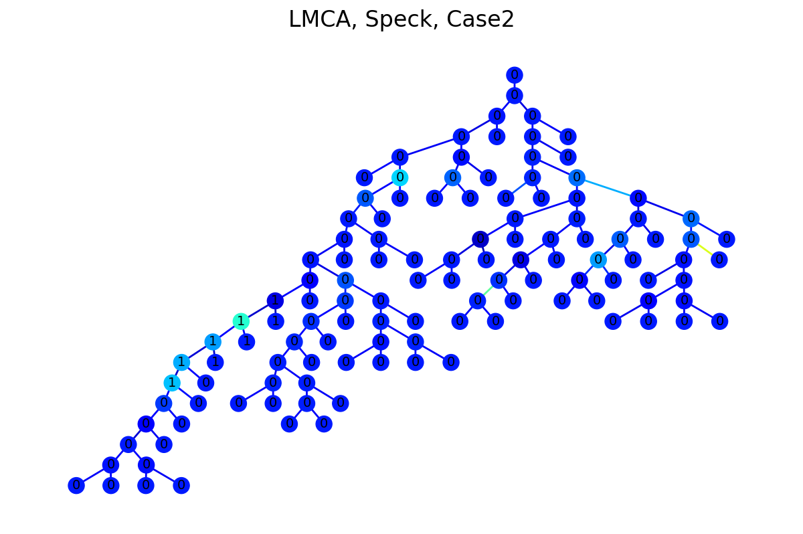
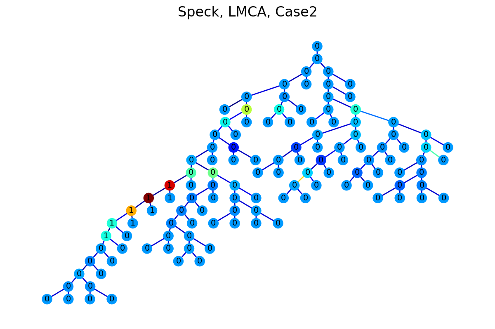
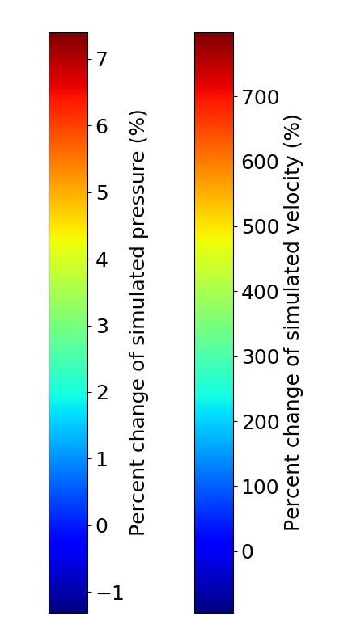

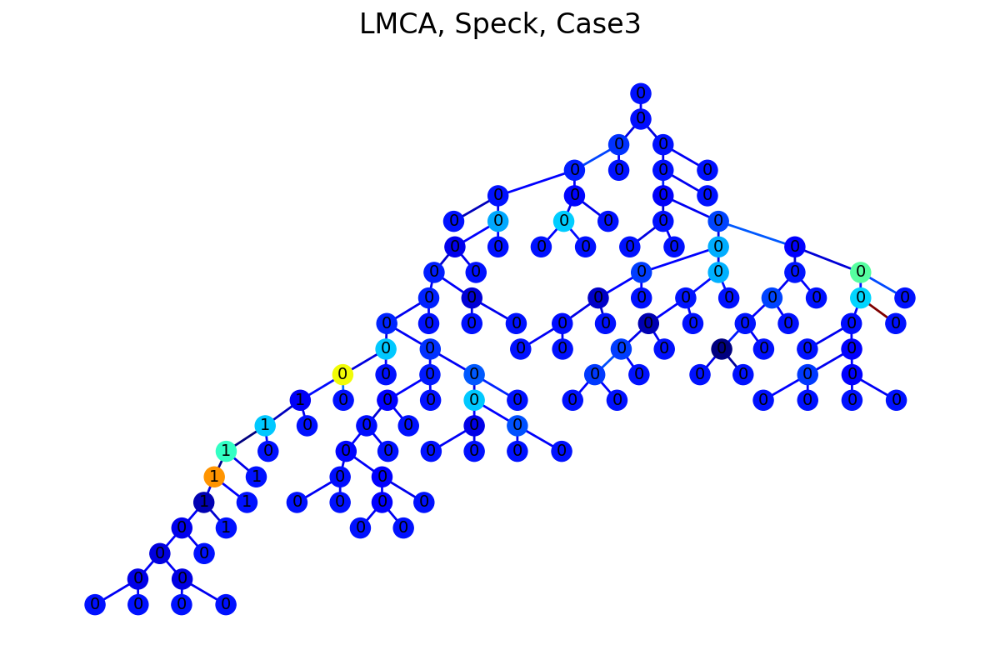
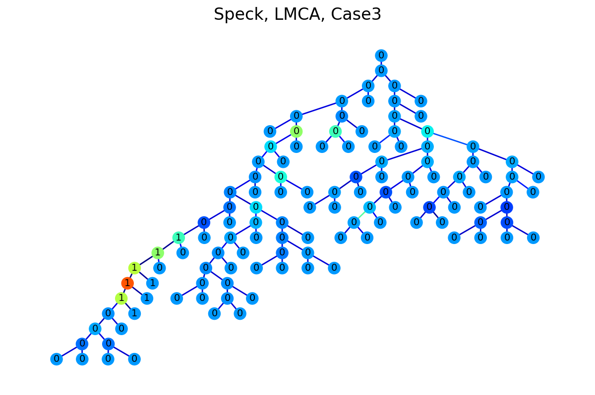
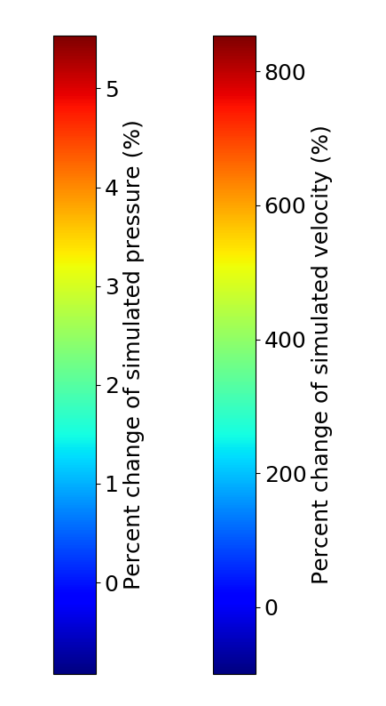

Pressure difference (shown by the color of the nodes) and flow velocity difference (shown by the color of the edges) before and after the radius of several selected segments are reduced by 30\% (left) or 70\% (right) of Speck LMCA. The selected segments have the value at both its end to be labeled as 1 and are chosen in three different ways: (1) N segments are chosen randomly in the network. (2) N segments are the immediate downstream segments below a random node (mimicking the condition when there is a stroke). (3) N segments are located in a random confined area (mimicking the condition when there is a tumor). 

---
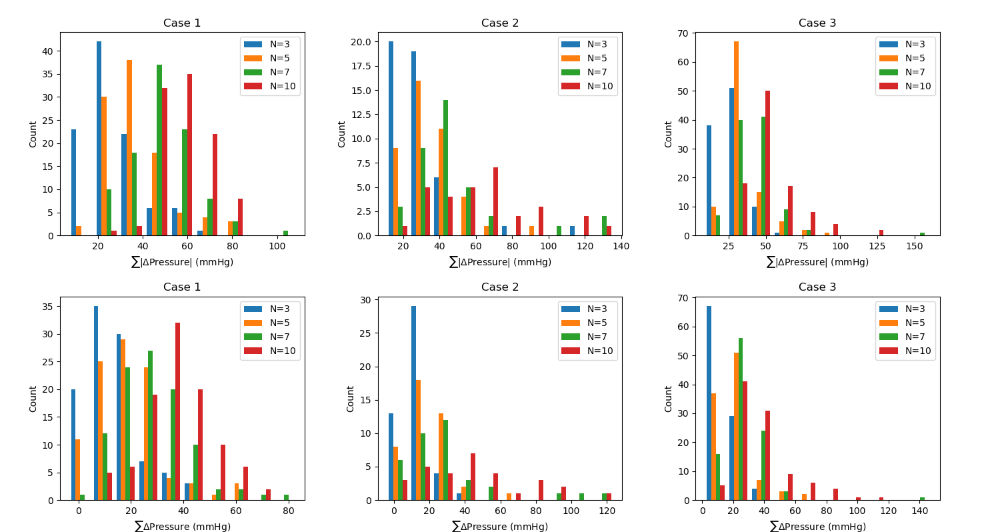

The distribution of sum of the absolute pressure differences and the sum of pressure differences before and after radius of selected segments in LMCA are reduced. The segments are chosen in three different ways: (1) N segments are chosen randomly in the network; (2) N segments are the immediate downstream segments below a random node (mimicking the condition when there is a stroke); and (3) N segments are located in a random confined area (mimicking the condition when there is a tumor).
